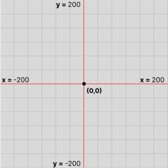
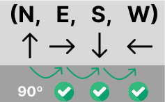
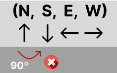

# Mars Rover Mission

## Your task

You’re part of the team that explores Mars by sending remotely controlled vehicles to the surface of the planet. Develop a software that translates the commands sent from earth to instructions that are understood by the rover.

- You are given the initial starting point (x,y) of a rover and the direction (N,S,E,W)
it is facing.

- The rover receives a collection of commands. (E.g.) FFRRFFFRL
- The rover can move forward (f).
- The rover can move left/right (l,r).
- Suppose we are on a really weird planet that is square. 200x200 for example :)
- Implement obstacle detection before each move to a new square. If a given
sequence of commands encounters an obstacle, the rover moves up to the last
possible point, aborts the sequence and reports the obstacle.

## Take into account

- Rovers are expensive, make sure the software works as expected.

<br>
<br>
<br>


## Choosing a programming language

I usually doAdvent of Code and other algorithmic challengesm and I've always used Python, since it was the first language I learned along with Javascript, and I find it easier to apply to these kinds of problems, so first I'm going to implement the logic in Python.

## Planet

Bidimensional grid, which size is N x N, in this case 200 x 200
this is how I imagine the planet:



## Rover

I have think about this and the best option as far as I know is to create a class with attributes and methods.

## Attributes

Rover is going to have an initial starting point (x,y)
Rover also need a direction (N,S,E,W)

```python
class Rover:_
    def __init__(self, x:int, y:int, direction:str):
```
```x:int``` and ```y:int``` are the coordinates of the initial position.

Regarding the initial direction of the Rover, I am planning to use an array ```DIRECTIONS = ["N","S","E","W"] ``` where each index is going to be associated with the Strig inside its index. 

I will try to explain myself better: If Rover turns right (90º) we will "jump" one index position, like a cycle of steps.
But to make it possible we have to change the order of the items inside ```DIRECTIONS``` to ```DIRECTIONS = ["N","E","S","W"]```.

If we are facing Nord ("N") -> Index 0 and turn right 90 degrees we are going to be heading to East ("E") -> Index 1.

If we turn again 90 degrees to the right, South ("S")-> Index 2 , and then West ("W")-> Index 3.

But this is only possible  using ("N", "E", "S", "W"). 

I will need to perform some logic when the turn is to the left because we will "jump" from Nord ("N") -> Index 0 to last index of the array West ("W")-> Index 3



The given example it's not oging to allow this behaviour



## Methods

Now it's time to think about the functions to turn left and right, but also to move forward. There is no need to move backwards because we can turn 2 times lef or right, and move forward.


```python
def turn_left(self)
```
Find current direction of Rover.

Substract 1 to the index of directions.

Assign the index of the new direction.

<br>
<br>

```python
def turn_right(self)
```

Find current direction of Rover.

Add 1 to the index of directions.

Assign the index of the new direction.

<br>
<br>


```python
def move_forward(self, obstacles:set, grid_size:int) -> bool
```
**Args:**

obstacles: set of coordinates -> {(0,2),(1,3)}

grid_size:  integer representing the square grid

**Returns:**

True: If the move was successful.

False: If the move would go off-grid or hit an obstacle.

<br>
<br>
 
```python
def execute_collection_commands(self, commands:str, obstacles:set, grid_size:int ) -> tuple[int, int, str, bool, tuple[int, int] |  None]:
```

**Args:**

commands : string of instructions -> ```"FFRFLF"```.

obstacles : set of coordinates -> ```{(0,2),(1,3)}```.

grid_size:  integer representing the square grid ```200```.

**Returns:**

```x``` : integer representing final X Axis position.

```y``` : integer representing final Y Axis position.

direction : string to know the Final direction of Rover -> ```"N"``` (Nord).

aborted? : boolean that will output ```True``` if execution was aborted.

obstacle_position: It can be a tuple or a ```None``` value. That's why:
- If aborted move by obstacle ->  the obstacle by ```tuple[int,int]```.
- If aborted by grid limits -> ```None``` will be displayed instead.
- If not aborted : Also will return ```None```.

<br>
<br>
<br>
<br>

Before go on with the implementation of ```move_forward``` and ```execute_collection_commands``` I will use a ```test.py``` file to see if if ```turn_left()``` and ```turn_right()``` are perfoming as expected.

Testing Succeed ✅ 
[Commit Link](https://github.com/DiegoLSdev/MarsRoverMision/commit/c3875fea1f94bb09b4dcf0f6f7eb0c6023bcc2b1)